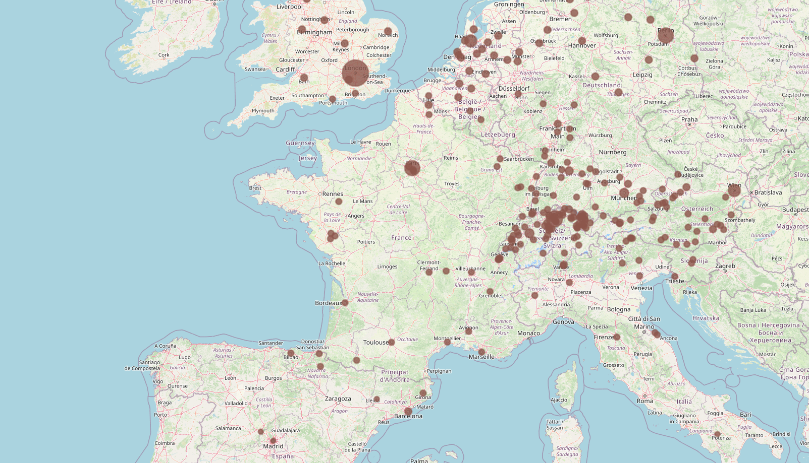

In this project, we took on the task of visualizing the stakeholders network of the multi-storey timber design and construction sector. This visualization prototype was used by our collovratores in order to answer qualitative questions on the connection between architectural variety in timber construction and the stakeholders involved.

In this project, we provide two ways of visualzing the stakeholders network, either as as node-link diagram with different encoding options as seen in Figure 1 or as a geographical map as seen in Figure 2. 

<!-- <figure>
  
  <figcaption>Figure 1: Projects Network. Projects are ring nodes. Flags are stakeholder headquarters locations. Colored dots are stakeholder type.</figcaption>
</figure> -->

<!-- <figure>
  
  <figcaption>Figure 2: Map of stakeholder locations. Dots represent cities where at least one stakeholder is headquartered.</figcaption>
</figure> -->

I used D3js, leaflet, javacript, html, and CSS to visualize to design and build this protype.

A live proptype could be found here:

please read <cite><a href="/publication/abdelaal-2022-visualization">our paper</a></cite> for mere details.

----

Used Tech : D3js, leaflet, Javascript, HTML, CSS