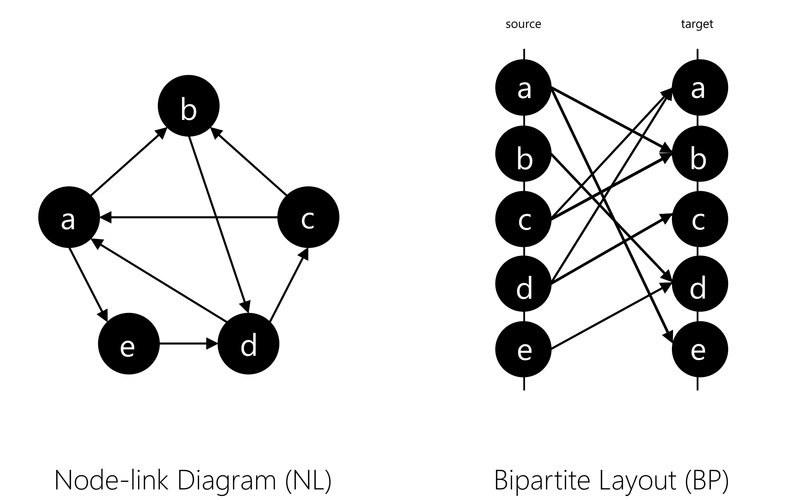

In this project, we undertook the task of answering the question "What is a bipartite layout good for?". Before we begin, we must distinguish between bipartite graphs and bipartite layouts. Bipartite graphs are a special kind of graph where the vertices are partitioned into two disjoint sets. These graphs are often found in biological and biochemical reaction networks. To visualize bipartite graphs, we use two parallel axes to denote the two sets of vertices and lines to visualize the connections between them. In this work, however, we are interested in the usage of bipartite layouts for visualizing single-mode graphs (i.e., one set of vertices). In this case, we still have the two parallel axes, but the vertices are replicated on both axes with the same order (see Figure 1).

<figure>
  
  <figcaption>Figure 1 - Bipartite Layout. To visualize single-mode networks, the graph vertices are replicated on both axes in the same order. The left axis denotes the source nodes, while the right one denotes the target nodes.</figcaption>
</figure>

The use of bipartite layout (BP) to visualize single-mode networks was proposed by Burch et al., where they introduced the idea of using it for visualizing dynamic networks (i.e., networks that change over time). To encode the time dimension, the individual networks from different time points are juxtaposed next to each other in a small multiples fashion. Several subsequent techniques were introduced aiming to increase the scalability of parallel edge splatting with respect to the number of time points. However, the main question "What is a bipartite layout good for?" remained unanswered, especially in comparison to other well-known layouts such as node-link diagrams (NL) or adjacent matrices (AM), which we attempted to tackle in this research (see Figure 2).

<figure>
  
  
  
  <figcaption>Figure 2 - What is a bipartite layout good for? especially in comparison with NL and AM</figcaption>
</figure>

As seen in Figure 3, BP share some characteristics with both NL and AM. BP and AM both replicate the network nodes on two axes representing the source and target axes. However, the axes in AM are orthogonal to each other rather than parallel as in BP. Additionaly, both layouts relies on vertex ordering algorithms to reveal the network structural properties. This suggests that BP would have similar user performance (i.e., time and accuracy) to AM when it comes to tasks such as finding clusters in a network or solving network tasks that are based on node properties. On the other hand, both NL and BP use lines to depict the connectivity between the nodes. In networks with a lot of links, these lines are typically drawing on top of each other, conveying the notion of a dense network. This suggests that BP would have similar performance to NL when it comes to network density estimation tasks or tasks that are based on edge properties.

<figure>
  
  <figcaption>Figure 3 - NL vs. AM vs. BP. A theoretical comparison across five different cirteria.</figcaption>
</figure>

The previous arguments might hold for small and sparse networks. However, in this project, we were interested in comparing the three layouts on large networks (i.e., 500 nodes) with varying densities. Figure 4 shows how the three layouts look under three density profiles (row-wise) and four different network topological features (column-wise). All networks are of size 500 nodes. Please refer to our paper for more details on how the density profiles were computed. Network size (i.e., number of nodes) is an important variable for evaluation. Most of the previous work (except for the work of Yoghourdjian et al., 2018) investigated small networks with fewer than 100 nodes. Therefore, it is worth investigating if the findings of previous work still hold on large networks, especially for AM. As the network grows in size, the number of pixels used to represent the network links shrinks (assuming a fixed screen size). This can be seen in the top two rows (low and mid-density profiles). The network density seems to be a crucial variable, especially for NL and BP. Due to the limited drawing space, BP is the least scalable among the three representations with respect to the network density. Hence, our decision to opt for large networks with three density profiles.

<figure>
  
  <figcaption>Figure 4 - NL vs. AM vs. BP. How the three layouts look like under three desnity profiles (row-wise) and four different network toplogical features (column-wise). All networks are of size 500 nodes. </figcaption>
</figure>

The network size implicitly dictates the types of tasks to be performed. Most of the previous work targeted small networks; hence, the focus was often on assessing user performance with respect to detailed tasks, such as finding a path between two nodes or counting how many links a node has. In our work, however, since we target large networks, our focus shifted towards overview tasks, such as comparing the topological features of two networks (T1), counting how many clusters are in a network (T2), or comparing the density of two networks (T3). Nevertheless, we did consider two detailed tasks (T4 and T5) to assess which representation, AM or BP, is easier to map to NL and hence easier to understand. But we are not focusing on them here. Figure 5 shows the same figure we used before to compare the three layouts but now updated with the five tasks together with the hypotheses behind them. Please check out the paper if you want to know how we arrived at those hypotheses.
<figure>
  
  <figcaption>Figure 5 - In contrast to previous work, which covers mostly topology-based tasks in small datasets, we mainly focus on overview tasks for large and directed networks. We consider three overview tasks on networks with 500 nodes: (T1) network class identification, (T2) cluster detection, and (T3) network density estimation, and two detailed tasks: (T4) node in-degree vs. out-degree and (T5) representation mapping, on networks with 50 and 20 nodes, respectively.</figcaption>
</figure>

To validate these hypotheses, we conducted a crowdsourced user study. We opted for a between-subject design with three conditions, one for each layout. We aimed for 50 participants per condition, making the total number of participants (N=150). We recruited the study participants through Amazon Mechanical Turk (mTurk). The participants were compensated, and the study was ethically approved by the university ethics committee. For more details about the study procedure, participants, and simulated data, please check out our paper.

Figure 6 shows the overall results. When it comes to comparing network topological features (T1), BP did indeed behave similarly to AM, and both were significantly more accurate than NL. This was in line with our hypothesis, which was driven from Figure 4. As one can see, as the network density increases, NL converges into this "hair-ball" and therefore has a hard time maintaining the network topological features. While one might argue that this is a side effect of the force layout algorithm we used (d3-force), our experience [5] shows that other best-of-breed layout algorithms such as neato or sfdp produced similar visual results. In contrast, AM and BP rely on vertex ordering methods to reveal network structural properties, which appear to be scalable with respect to the density variable.

<figure>
  
  <figcaption>Figure 6 - The overall accuracy of tasks T1 – T3. The shapes represent the means, and the error bars their 95% CIs.</figcaption>
</figure>

When it comes to cluster detection (T2), we hypothesized that NL would outperform both AM and BP, especially on sparse networks. This is due to the fact that NL doubly encodes the cluster information through two variables: the proximity and the connectivity between the nodes. In contrast, AM and BP both rely only on the visibility of the links to encode such information, and since the links are less visible in AM than they are in BP, we hypothesized that BP would outperform AM. While the results agree on the NL part, they disagree on the comparison between AM and BP. Especially with low density (i.e., sparse) networks, participants had a hard time spotting the clusters, which was also reflected in their commentary feedback. One explanation could be that the overdrawing in BP might have impaired the recognition of clusters in BP compared to AM.

With respect to comparing the density of two networks (T3), both NL and AM are significantly more accurate than BP. The results suggest that BP has the least sensitivity to density changes. BP, and to a lesser degree NL, rely on edge overdrawing to convey the notion of density. In our study, we used the opacity variable to reduce visual clutter. As such, the denser the network, the lighter and smoother the lines will appear. For a non-trained eye, that might be misleading. In contrast, AM relies on what we call "edge packing" to convey the density, which changes the overall contrast of the image, making the comparison task more intuitive. The darker the image, the denser the network.

To summarize, for tasks that involve comparing the overall network structure, AM and BP might be better candidates than NL. Both representations are versatile enough to depict various structural properties and maintain these properties under varying densities. This also suggests that vertex-ordering-based techniques are effective at showing network structural properties under varying densities.

When the task involves identifying network clusters or sub-communities, NL seems to be superior to both AM and BP since the cluster information is doubly encoded by the proximity and connectivity between the nodes. This also suggests that the visibility of links plays a less important role in detecting network clusters than the proximity of nodes.

When the task at hand is about estimating overall density or detecting subtle changes in connectivity, BP does not seem to be a good choice due to the overdrawing problem. In such situations, AM provides the most accurate estimation of the true density within the network. That also implies that edge packing provides a more accurate representation of density than edge overdrawing.

If you're still interested in reading more or curious about what the study participants said about each task, please check out the paper. There, you will also find a link to download all the supplemental materials, including source code, data files, and screenshots of the study.

Used Tech:
HTML
JS
Java
R
