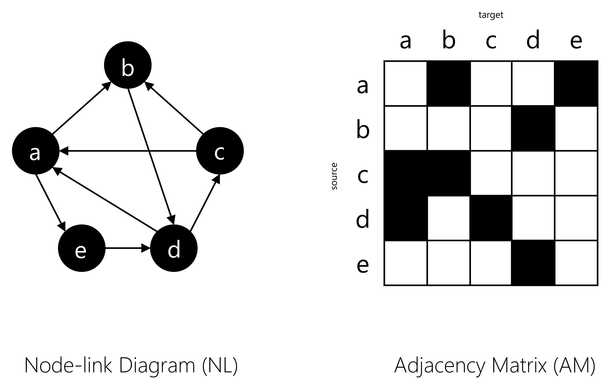

Node-link diagrams (NL) and adjacency matrices (AM) are two of the most common techniques used to visualize networks (see Figure 1). NL is easy to understand and usually preferred [^1] when the task at hand is path-related. However, the technique doesn't scale well as the density of the network grows, resulting in the famous "hair-ball" effect. AM, in contrast, provides better scalability with network density, but it comes at the cost of understandability and the screen space consumed by the technique grows quadratically as the network grows in size. In literature, several techniques have been proposed attempting to combine both NL and AM in one hybrid approach [^2]. In the real world, networks are rarely static but rather evolving (i.e., dynamic networks). Having time as an additional dimension besides network size and density makes the visualization task even more challenging. A visualization technique not only needs to be scalable with respect to size and density but also with respect to time.

<figure>
  
  <figcaption>Figure 1: Node-link diagram and adjacency matrices (AM) are two of the most common techniques used to visualize static networks.</figcaption>
</figure>

There are two main schools for visualizing dynamic networks [^3]: those who advocate for the use of animation, also referred to as "time-to-time mapping," and those who advocate for the use of the screen space, also referred to as "time-to-space mapping," to encode the time variable. In their seminal research, Tversky et al. [^4] made the case for the latter against the former. According to the "Congruence Principle", the content and format of the graphic should correspond to the content and format of the concepts to be conveyed. While animation might satisfy that principle, it is often too fast to be accurately apprehended and less effective than its static counterpart, and therefore, doesn't satisfy the "Apprehension Principle."

<figure>
  
  <figcaption>Figure 2: The Galloping Horse Problem serves as a perfect illustration of the difficulty in grasping the complex interaction of the horse's legs while it is running at high speed. “Baronet” by George Stubbs, 1794.</figcaption>
</figure>

In this project, we extended the state-of-the-art of dynamic network visualization by developing time-to-space mapping approaches based on Bipartite Layout (BP). The layout was first proposed for dynamic network visualization by Burch et al.[^5], where the different network snapshots from different time points are juxtaposed next to each other in a small multiple fashion (see Figure 3). To improve the scalability of the technique with respect to time, they later proposed interleaving [^6] the BP for different time points. However, such a method resulted in a significant amount of overdrawing, making it only suitable for sparse networks. In <cite><a href="/publication/abdelaal-2018-clustering">our work</a></cite>, we attempted to tackle this issue by "stacking" the individual time points instead of interleaving them, which proves to be beneficial in revealing the network's temporal patterns (see Figure 4).

<figure>
  
  <figcaption>Figure 3: Parallel Edge Splatting BP layouts are juxtaposed next to each other to depict different network snapshots.</figcaption>
</figure>

<figure>
  
  
  <figcaption>Figure 4: Interleaved BP vs. Stacked BP. Stacking BP proves to be beneficial in revealing the network's temporal patterns.</figcaption>
</figure>

In later work, we introduced the <cite><a href="/publication/abdelaal-2020-time">Time-aligned Edge Plots</a></cite> as an alternative way of drawing the BP layout over time. Instead of redrawing the edges at each time point, we only draw them once, through time. In this way, we exploit the line stroke style (i.e., dashed, dotted, solid, etc.) to convey the temporal patterns in the network. Sometimes we refer to this method as "Striped BP" or "striping" for short. This method proves to be more scalable with respect to the network density (see Figure 5).

<figure>
  
  
  
  

    (a)
    (b)
    (c)
  

  
  
  <figcaption>Figure 5: Time-aligned Edge Plots proves to be more scalable than current state-of-the-art with respect to the network density.</figcaption>
</figure>

Since we talk about scalability a lot, we realized that sometimes in literature the term is used to refer to different things. So we undertook the job of revisiting the current visualization literature to try to clarify what people mean when they talk about scalability. <cite><a href="/publication/richer-2022-scalability">Read more</a></cite>.

----
[^1] seminal ghonaim
[^2] node trix
[^3] Fabian bech survery
[^4] congurence
[^5] parallel edge splatting
[^6] interleaving

Used Tech : JAVA, Servlets, HTML, JavaScript (vanilla), D3.js, SVG, Canvas 

<!-- HTML
JS
Java
R -->