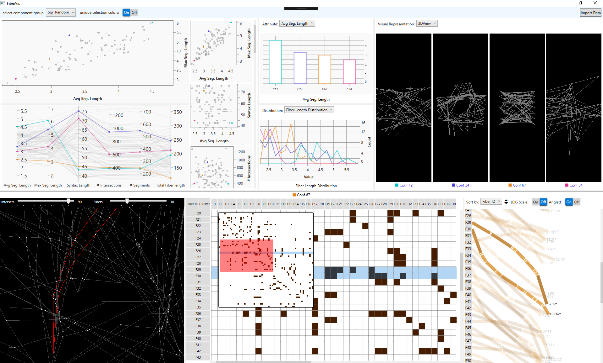

<!-- This project falls within the context of the cluster of excellence (<a href="https://www.intcdc.uni-stuttgart.de/">IntCDC</a>), which is a large cluster of research projects funded by the German Research Foundation (DFG) covering different disciplines that span from architecture, structural engineering, and building physics all the way to engineering geodesy, manufacturing, system engineering, robotics, and social sciences. All coming together to push the architecture, engineering, and construction (AEC) industry forward to address its challenges of building housing and infrastructure for over 2.5 billion people in urban areas over the next 30 years. It is no secret[^1] that the productivity of the AEC industry is stagnating, if not declining, especially when compared with other industries such as agriculture or automotive, which have benefited from automation and digitization decades ago. Current methods applied by the AEC, and in particular the construction sector, are still labor-intensive and are significant contributors to climate change, global energy use, global waste, and global greenhouse gases [^1].

In <cite><a href="/publication/abdelaal-2022-visualization">our work</a></cite>, we attempted to characterize the AEC industry and explain why it is not as straightforward to automate the industry using the same methods applied in the automotive industry. There are already some promising efforts [^2] towards automation and digitization using computational design methods integrated with robotic fabrication, which promise to address many of the challenges facing the AEC industry. However, to realize the full potential of these efforts, there is a demand for digital tools to back and support them. Hence, the importance of visualization and visual analytics tools. -->

<!-- In that context, I took part in a few projects focused on building and designing visualization tools for architects and designers.  -->

In collaboration with experts from the architecture domain, we designed and built FiberVis, a tool for exploring the simulation results of coreless filament wound structures (CFW). Figure 1 shows some of the visualizations we implemented. Parallel coordinates plots and scatter plot matrices provide an overview of the solution space. Small multiples representations together with the line- and column-chart enable the comparison between the candidate solutions. For more information please read the <cite><a href="/publication/abdelaal-2022-visualization">full article</a></cite>.

<!-- <figure>
  
  <figcaption>Figure 1: FiberVis tool to support the analysis and exploration of CFWS at different levels of details.</figcaption>
</figure> -->

----
<!-- [^1]: United Nations, “Buildings and climate change: Summary for decision makers,” UNEP DTIE, Sustainable Consumption and Production Branch, Nairobi, Kenya, Tech. Rep. 987-92-807-3064-7, 2009
[^2]:  N. Dambrosio et al., “BUGA fibre pavilion: Towards an architectural application of novel fiber composite building systems,” in Proc. 39th Annu. Conf. Assoc. Comput. Aided Des. Archit., 2019, pp. 140–149
[^3]:  M. Sedlmair, M. Meyer, and T. Munzner, “Design study methodology: Reflections from the trenches and the stacks,” IEEE Trans. Vis. Comput. Graphics, vol. 18, no. 12, pp. 2431–2440, Dec. 2012
[^4]: E. Kerzner, S. Goodwin, J. Dykes, S. Jones, and M. Meyer, “A framework for creative visualizationopportunities workshops,” IEEE Trans. Vis. Comput. Graphics, vol. 25, no. 1, pp. 748–758, Jan. 2019. -->

Used Tech : C#, .NET, WPF, Rhino/Grasshopper, <a href="https://www.scichart.com/">SciChart</a>